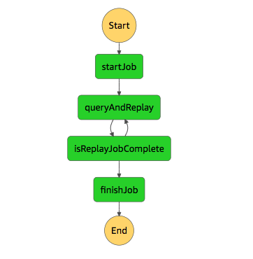

To invoke, POST to the endpoint using the given API Key, e.g.

curl -X POST -d '{"type":"com.example.someevent","startDate":"2021-06-02-06:15", "endDate":"2021-06-02-10:44"}' -k https://xxxxxx.execute-api.us-east-1.amazonaws.com/dev/create -H 'X-Api-Key:xxxxxx'

The state machine looks like this:



When deployed the state machine definition looks like:

```
{
  "Comment": "Two steps FTW!",
  "StartAt": "startJob",
  "States": {
    "startJob": {
      "Type": "Task",
      "TimeoutSeconds": 30,
      "Resource": "arn:aws:lambda:us-east-1:xxxxxxxxx:function:replay-dev-startJob",
      "Next": "queryAndReplay"
    },
    "queryAndReplay": {
      "Type": "Task",
      "TimeoutSeconds": 30,
      "Resource": "arn:aws:lambda:us-east-1:xxxxxxxxx:function:replay-dev-executeQuery",
      "Next": "isReplayJobComplete"
    },
    "isReplayJobComplete": {
      "Type": "Choice",
      "Choices": [
        {
          "Variable": "$.queryState",
          "StringEquals": "running",
          "Next": "queryAndReplay"
        }
      ],
      "Default": "finishJob"
    },
    "finishJob": {
      "Type": "Pass",
      "End": true
    }
  }
}
```